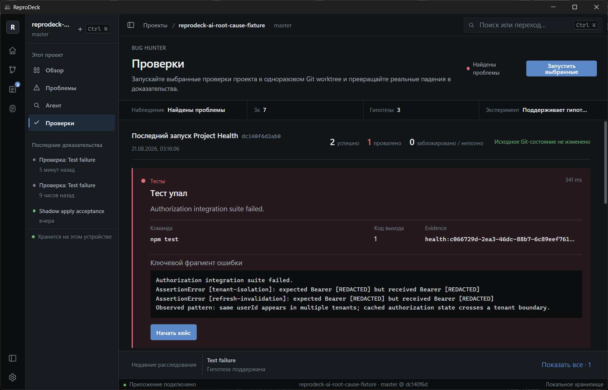
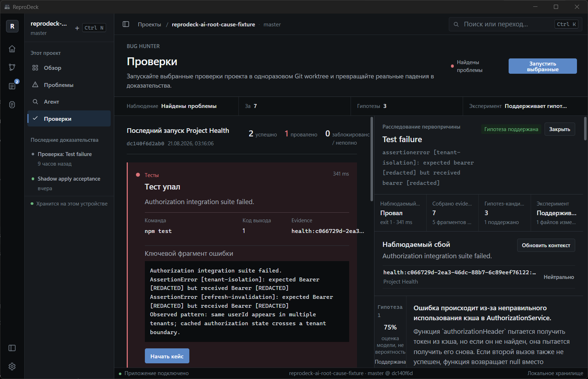
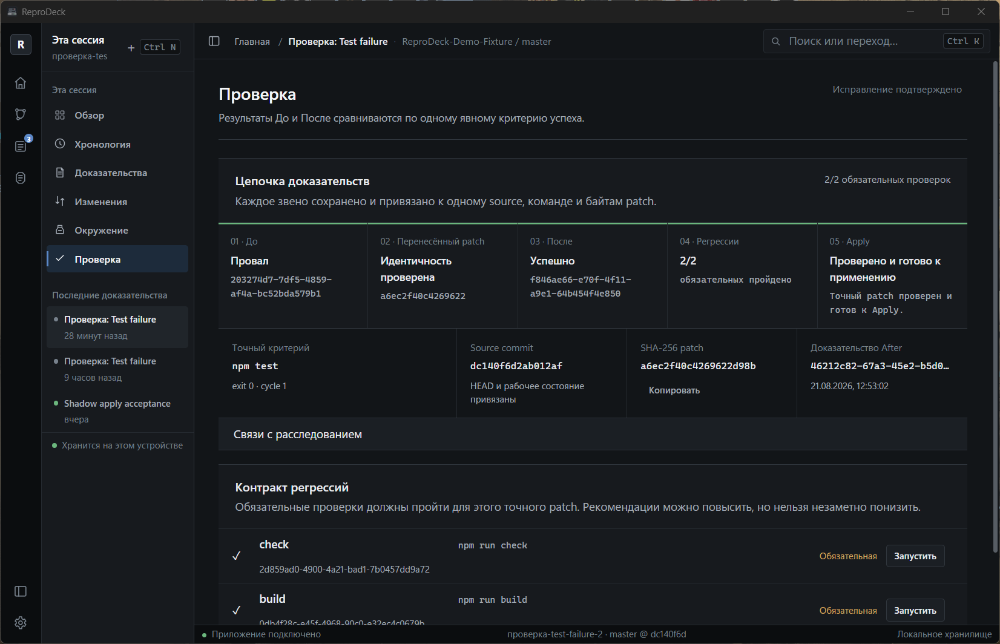
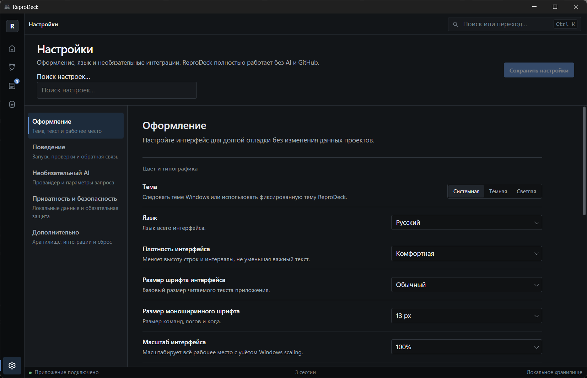
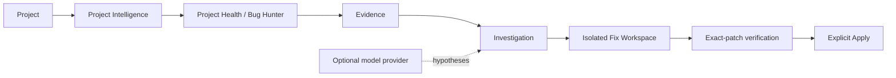

[English](README.md) · [Русский](README.ru.md)

# ReproDeck

**Evidence-first debugging workbench for AI-assisted code fixes.**

AI can propose a fix. ReproDeck helps prove whether it fixes the observed bug before those bytes touch your repository. It combines root-cause analysis, causal experiments, exact-patch verification, and an explicit Apply boundary in a local-first Tauri desktop tool.

`Observe → Evidence → Hypothesis → Experiment → Verify exact patch → Apply`

[**Download for Windows**](https://github.com/t1ktakdev/ReproDeck/releases/download/v0.3.0/ReproDeck_0.3.0_x64-setup.exe) · [**Try the deterministic demo**](docs/demo.md)

[](https://github.com/t1ktakdev/ReproDeck/actions/workflows/ci.yml) [](https://github.com/t1ktakdev/ReproDeck/releases/latest) [](LICENSE)

> Windows 11 is tested. The current community installer is not Authenticode-signed; Windows may show a publisher warning. See [Installation](#installation).



*Capture a real failure in an isolated Git worktree without changing the original repository.*

## Why ReproDeck?

A common AI-assisted debugging loop is short but ambiguous:

`Bug → prompt → patch → run tests → hope`

ReproDeck adds an inspectable proof chain:

`Failure → Evidence → Falsifiable hypotheses → Causal experiment → Exact patch identity → Before/After verification → Required regressions → Explicit Apply`

ReproDeck does not replace Claude Code, Codex, Cursor, or another coding model. Use the model you already trust—or no model at all. ReproDeck adds evidence, causal experiments, and backend-enforced code verification around the workflow.

## See the workflow



*Turn logs and source context into evidence-backed engineering hypotheses. AI remains an optional component, not the source of truth.*



*Verify the exact patch that passed Before/After and required regressions before Apply becomes available.*



*Control language, density, typography, motion, layout, local storage, and optional AI settings.*

These are native ReproDeck v0.3.0 captures on Windows at 125% scaling, not mockups.

## Key features

- **Evidence-first investigations** — Project Health receipts, source context, checksums, relationships, and persistent Investigation Cases.
- **Smart Bug Hunter** — deterministic diagnostic ordering, failure clustering, blockers, and a direct path from failed checks to investigation.
- **Context transparency** — inspect every selected snippet, range, reason, and context budget before it can reach a provider.
- **Structured hypotheses** — up to three evidence-cited, falsifiable candidates with confidence caps and proposed experiments.
- **Causal experiments** — test one reviewed intervention in an isolated Git worktree while checking original-repository integrity.
- **Exact verified patch identity** — bind source commit and working state, criterion, shadow commit, and binary patch SHA-256 to the After proof.
- **Required regression gates** — every required check must pass for the same patch bytes; changing the patch invalidates Ready to Apply.
- **Safe explicit Apply** — reviewed diff, backend-gated identity checks, path protections, conflict checks, and action receipts.
- **Recovery and replay** — durable recovery records plus integrity-checked `.reprodeck` capsules.
- **Local-first desktop workbench** — Rust core, React/Tauri UI, SQLite history, RU/EN interface, keyboard-first navigation, and no telemetry.

## Installation

### Windows x64

1. Open the [latest GitHub Release](https://github.com/t1ktakdev/ReproDeck/releases/latest).
2. Download `ReproDeck_0.3.0_x64-setup.exe`.
3. Optionally verify it against `SHA256SUMS.txt` in the release assets.
4. Run the per-user installer.

The v0.3.0 community build is tested on Windows 11 and is currently unsigned. Confirm the filename and checksum before continuing through any Windows publisher warning. ReproDeck does not silently remove its local application data during uninstall.

### Build from source

Prerequisites: Node.js 22+, Rust stable, Git, and the [Tauri 2 platform prerequisites](https://v2.tauri.app/start/prerequisites/).

```powershell
git clone https://github.com/t1ktakdev/ReproDeck.git
Set-Location ReproDeck
npm ci
npm run tauri dev
```

Run the complete Windows quality gate with `.\scripts\verify-windows.cmd -SkipInstall`.

## Try the demo

Choose **Try demo** on the empty Home screen. ReproDeck creates a unique dependency-free Git fixture and opens it without executing project commands.

| Check | Expected result |
| --- | --- |
| `npm run check` | PASS |
| `npm test` | FAILED |
| `npm run build` | PASS |

The failure has multiple symptoms and one shared root cause; the fixture documentation does not spoil it. The original fixture remains untouched through investigation and causal experiments until explicit Apply.

```powershell
.\scripts\create-demo-fixture.ps1
npm run tauri dev
```

Follow the walkthrough and safety assertions in [docs/demo.md](docs/demo.md).

## Safety model

- The original repository remains unchanged during Project Health, Investigation, Fix Workspace, experiments, and verification.
- Experiments and candidate patches run in isolated Git worktrees.
- AI output is a proposal, never proof. Unknown evidence citations are rejected by Core.
- Known secret paths are excluded; selected context and output are bounded and redacted.
- Apply requires explicit user action and is bound to the exact patch that passed verification.
- Changing the patch, source commit/state, success criterion, or required receipts invalidates Ready to Apply.
- Required regressions must pass before Apply becomes available.
- Commands use executable plus argv boundaries; privilege-escalation commands are denied.
- **Git worktrees isolate repository writes, not operating-system access. Project code runs with your user permissions and is not OS-sandboxed. Run only code you trust.**

Read [SECURITY.md](SECURITY.md) and [docs/security-model.md](docs/security-model.md).

## Optional AI providers

ReproDeck works without AI. When enabled, it supports OpenAI-compatible APIs, including local providers such as LM Studio.

```text
Base URL: http://127.0.0.1:1234/v1
Model: Qwen2.5 Coder 7B Instruct
```

This profile passed a Windows field test; use the exact model identifier loaded by your server. The model proposes hypotheses. ReproDeck's evidence and verification layers remain authoritative. Requests require explicit action, and the API key is not persisted in ReproDeck settings.

## Privacy

- Local-first storage; no account is required for the core workflow.
- No telemetry, ads, automatic repository upload, commit, or push.
- API keys are not persisted.
- AI context is inspectable, bounded, and redacted; known secret paths are excluded before compilation.

GitHub and AI providers are optional network integrations. See [SECURITY.md](SECURITY.md).

## Architecture



The Rust core owns evidence, redaction, process boundaries, worktrees, verification state, and Apply. React renders the workbench through a thin Tauri adapter; UI or model text cannot manufacture a Verified Fix. See [docs/architecture.md](docs/architecture.md).

## CLI

```powershell
cargo run -p reprodeck-cli -- doctor
cargo run -p reprodeck-cli -- repo C:\path\to\repository
cargo run -p reprodeck-cli -- capsule C:\path\to\session.reprodeck
```

`doctor` checks prerequisites, `repo` prints deterministic repository intelligence, and `capsule` validates a capsule without importing it.

## ReproDeck Bench

ReproDeck Bench is designed to measure verified-fix reliability, not model popularity. The deterministic runner records real check/test/build outcomes and original-repository integrity. No comparative model claims are published without controlled data. See [bench/README.md](bench/README.md).

## Platform support

| Platform | v0.3.0 status |
| --- | --- |
| Windows 11 x64 | Tested: development gate, native field flow, installer/install/uninstall |
| Linux | Core/CI source checks run; desktop runtime field verification pending |
| macOS | Not runtime-tested |

## Roadmap

- Linux desktop field testing.
- Signed Windows builds.
- A broader transparent benchmark suite.
- Large-repository performance validation.

Current boundaries are documented in [docs/implementation-status.md](docs/implementation-status.md) and [CHANGELOG.md](CHANGELOG.md).

## Documentation and contributing

- [FAQ](docs/FAQ.md)
- [Demo walkthrough](docs/demo.md)
- [Architecture](docs/architecture.md)
- [Security model](docs/security-model.md)
- [Development guide](docs/development.md)
- [Contributing](CONTRIBUTING.md)

ReproDeck is available under the [MIT License](LICENSE). If it is useful to you, starring the repository helps other developers find it.
