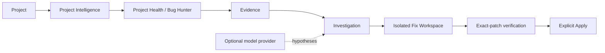

[English](README.md) · Русский

# ReproDeck

**Evidence-first workbench для проверки исправлений, предложенных AI.**

AI может предложить fix. ReproDeck помогает доказать, что изменения устраняют наблюдаемую ошибку, прежде чем их bytes попадут в исходный репозиторий. Это local-first desktop-инструмент на Tauri для root-cause анализа, каузальных экспериментов, проверки точного patch и явного Apply.

`Наблюдение → Evidence → Гипотеза → Эксперимент → Проверка точного patch → Apply`

[**Скачать для Windows**](https://github.com/t1ktakdev/ReproDeck/releases/download/v0.3.0/ReproDeck_0.3.0_x64-setup.exe) · [**Попробовать детерминированное demo**](docs/demo.md)

[](https://github.com/t1ktakdev/ReproDeck/actions/workflows/ci.yml) [](https://github.com/t1ktakdev/ReproDeck/releases/latest) [](LICENSE)

> ReproDeck протестирован на Windows 11. Текущий community installer не подписан Authenticode, поэтому Windows может показать предупреждение об издателе. Подробнее в разделе [Установка](#установка).


*Зафиксируйте реальный сбой в изолированном Git worktree, не меняя исходный репозиторий.*

## Зачем ReproDeck?

Обычный цикл AI-assisted debugging короткий, но не даёт однозначного доказательства:

`Ошибка → prompt → patch → тесты → надежда`

ReproDeck добавляет inspectable proof chain:

`Сбой → Evidence → Фальсифицируемые гипотезы → Каузальный эксперимент → Identity точного patch → Before/After → Required-регрессии → Явный Apply`

ReproDeck не заменяет Claude Code, Codex, Cursor или другую coding model. Используйте уже выбранную модель — либо работайте совсем без неё. ReproDeck добавляет evidence, causal experiments и backend-enforced code verification вокруг процесса.

## Рабочий процесс


*Превращайте логи и source context в engineering-гипотезы, связанные с evidence. AI остаётся необязательным компонентом, а не источником истины.*


*Проверьте тот же patch через Before/After и обязательные регрессии, прежде чем станет доступен Apply.*


*Управляйте языком, плотностью, типографикой, motion, layout, локальным хранилищем и необязательным AI.*

Это реальные capture нативного ReproDeck v0.3.0 на Windows при scaling 125%, а не mockups.

## Основные возможности

- **Evidence-first investigations** — receipts Project Health, source context, checksums, relationships и постоянные Investigation Cases.
- **Smart Bug Hunter** — детерминированный порядок диагностики, clustering падений, blockers и прямой переход от failed check к расследованию.
- **Прозрачный context** — каждый snippet, range, причина выбора и budget видны до отправки провайдеру.
- **Структурированные гипотезы** — до трёх evidence-cited фальсифицируемых кандидатов с confidence caps и предложенными экспериментами.
- **Каузальные эксперименты** — проверка одного просмотренного вмешательства в изолированном Git worktree с контролем integrity исходного репозитория.
- **Identity проверенного patch** — After proof связан с source commit/working state, criterion, shadow commit и SHA-256 бинарного patch.
- **Required regression gates** — каждая обязательная проверка проходит для тех же bytes; изменение patch отменяет Ready to Apply.
- **Безопасный явный Apply** — просмотр diff, backend identity gate, path protections, conflict checks и action receipts.
- **Recovery и replay** — durable recovery records и integrity-checked `.reprodeck` capsules.
- **Local-first desktop workbench** — Rust core, React/Tauri UI, SQLite history, RU/EN, keyboard-first navigation и отсутствие telemetry.

## Установка

### Windows x64

1. Откройте [последний GitHub Release](https://github.com/t1ktakdev/ReproDeck/releases/latest).
2. Скачайте `ReproDeck_0.3.0_x64-setup.exe`.
3. При желании сравните файл с `SHA256SUMS.txt` из release assets.
4. Запустите per-user installer.

Community build v0.3.0 протестирован на Windows 11 и пока не подписан. Проверьте filename и checksum перед продолжением после предупреждения Windows. ReproDeck не удаляет локальные данные приложения автоматически при uninstall.

### Сборка из исходников

Понадобятся Node.js 22+, Rust stable, Git и [системные зависимости Tauri 2](https://v2.tauri.app/start/prerequisites/).

```powershell
git clone https://github.com/t1ktakdev/ReproDeck.git
Set-Location ReproDeck
npm ci
npm run tauri dev
```

Полный Windows quality gate: `.\scripts\verify-windows.cmd -SkipInstall`.

## Попробуйте demo

На пустом Home нажмите **Попробовать demo**. ReproDeck создаст уникальный dependency-free Git fixture и откроет его без запуска project commands.

| Проверка | Результат |
| --- | --- |
| `npm run check` | PASS |
| `npm test` | FAILED |
| `npm run build` | PASS |

У падения несколько симптомов и одна общая root cause; документация fixture не раскрывает её заранее. Исходный fixture остаётся неизменным во время расследования и экспериментов до явного Apply.

```powershell
.\scripts\create-demo-fixture.ps1
npm run tauri dev
```

Полный walkthrough и safety assertions: [docs/demo.md](docs/demo.md).

## Safety model

- Исходный репозиторий остаётся неизменным во время Project Health, Investigation, Fix Workspace, experiments и verification.
- Эксперименты и candidate patches выполняются в изолированных Git worktrees.
- AI output — предложение, а не proof. Неизвестные evidence citations отклоняются Core.
- Известные secret paths исключаются; context и output ограничиваются и редактируются.
- Apply требует явного действия и привязан к точному patch, который прошёл verification.
- Изменение patch, source commit/state, success criterion или required receipts отменяет Ready to Apply.
- Required regressions должны пройти до доступности Apply.
- Команды используют границу executable + argv; privilege-escalation commands запрещены.
- **Git worktree изолирует изменения репозитория, а не доступ к ОС. Код проекта выполняется с правами пользователя и не находится в OS sandbox. Запускайте только доверенный код.**

Threat model и reporting policy: [SECURITY.md](SECURITY.md) и [docs/security-model.md](docs/security-model.md).

## Необязательные AI providers

ReproDeck полностью работает без AI. При включении поддерживаются OpenAI-compatible API, включая локальные providers вроде LM Studio.

```text
Base URL: http://127.0.0.1:1234/v1
Model: Qwen2.5 Coder 7B Instruct
```

Этот профиль прошёл Windows field test; укажите точный identifier модели, загруженной сервером. Модель предлагает гипотезы. Evidence и verification layers ReproDeck остаются authoritative. Запрос требует явного действия, API key не записывается в Settings.

## Приватность

- Local-first storage; для основного workflow не нужен account.
- Нет telemetry, рекламы, автоматической загрузки репозитория, commit или push.
- API keys не сохраняются.
- AI context inspectable, bounded и redacted; известные secret paths исключаются до compilation.

GitHub и AI providers — необязательные network integrations. См. [SECURITY.md](SECURITY.md).

## Архитектура



Rust core владеет evidence, redaction, process boundaries, worktrees, verification state и Apply. React отображает workbench через тонкий Tauri adapter; UI или model text не могут самостоятельно создать Verified Fix. См. [docs/architecture.md](docs/architecture.md).

## CLI

```powershell
cargo run -p reprodeck-cli -- doctor
cargo run -p reprodeck-cli -- repo C:\path\to\repository
cargo run -p reprodeck-cli -- capsule C:\path\to\session.reprodeck
```

`doctor` проверяет prerequisites, `repo` печатает детерминированный repository intelligence, `capsule` валидирует capsule без import.

## ReproDeck Bench

ReproDeck Bench измеряет verified-fix reliability, а не популярность моделей. Текущий детерминированный runner фиксирует фактические результаты check/test/build и integrity исходного репозитория. Сравнительные заявления без контролируемых данных не публикуются. См. [bench/README.md](bench/README.md).

## Поддержка платформ

| Платформа | Статус v0.3.0 |
| --- | --- |
| Windows 11 x64 | Протестированы development gate, нативный field flow, installer/install/uninstall |
| Linux | Core/CI source checks выполняются; runtime desktop field verification ожидается |
| macOS | Runtime не тестировался |

## Roadmap

- Linux desktop field testing.
- Подписанные Windows builds.
- Более широкий прозрачный benchmark suite.
- Проверка производительности на больших репозиториях.

Текущие границы описаны в [docs/implementation-status.md](docs/implementation-status.md) и [CHANGELOG.md](CHANGELOG.md).

## Документация и участие

- [FAQ](docs/FAQ.md)
- [Demo walkthrough](docs/demo.md)
- [Архитектура](docs/architecture.md)
- [Security model](docs/security-model.md)
- [Development guide](docs/development.md)
- [Contributing](CONTRIBUTING.md)

ReproDeck доступен по [MIT License](LICENSE). Если проект оказался полезен, star помогает другим разработчикам его найти.
